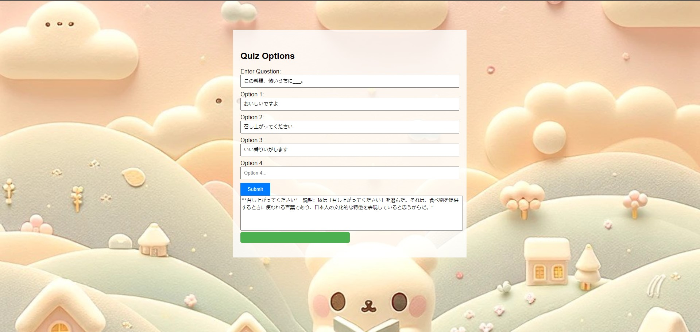
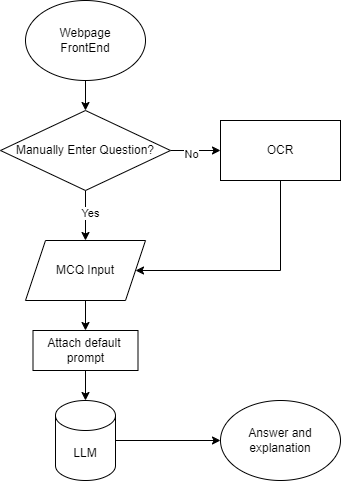
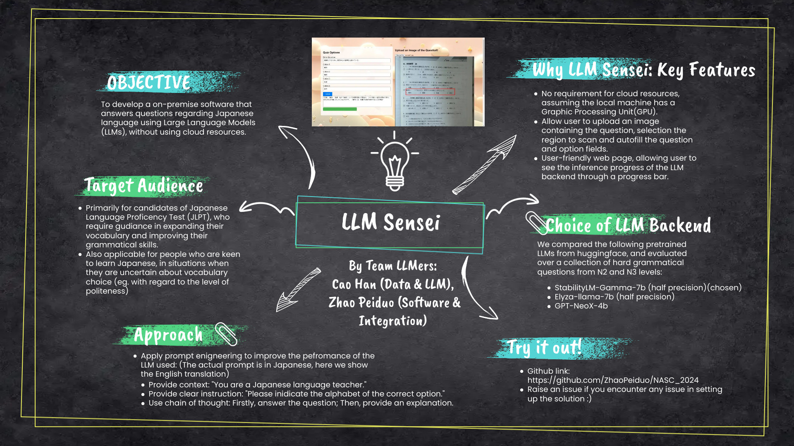

## LLM Sensei: Leveraging Large Language Model (LLM) to explain multiple-choice questions for JLPT preparation

By Team LLMers: Cao Han, Zhao Peiduo



This repository contains the model and user interface for LLM Sensei as the entry for National AI Student Challenge 2024, which has been selected as one of the finalist projects.

### Objective

LLM Sensei aims to generate answers and explanations for the input Japanese grammar questions, by using pretrained Japanese LLM and prompt engineering to obtain the desired output from the model.

### Requirements and Quick Start

This solution was written in Python 3.8.10, tested on a laptop with RTX4080 GPU, and will work optimally for other devices with compatible GPU resources.

To install the dependencies, you may want to create a virtual environement (using [virtualenvwrapper](https://virtualenvwrapper.readthedocs.io/en/latest/) for instance) and simply run: 

```
pip install -r requirements.txt
```

To run the application, use the following command:
```
uvicorn backend:app --reload
```

and open the corresponding localhost as indicated by the logging INFO (the default should be http://127.0.0.1:8000).

### Frontend (React) UI

- The app now ships a single-page React UI embedded directly in `frontend.html` (React via CDNs; no build step required).
- FastAPI serves `frontend.html` from `GET /` using Jinja2, so the above `uvicorn` command is sufficient.
- Live progress updates stream over a WebSocket at `/ws`. The UI shows:
  - Percentage: normalized to 0–100 based on backend progress values.
  - Phases: Idle → Answering → Explaining → Done.
  - Step chips to make the current phase obvious.

#### Using the app
- Enter a question and up to four options, then click Submit.
- Or upload an image, draw a rectangle around the question and options, and click Extract Text to auto-fill.
- The model’s selected answer and explanation will populate once ready; the progress UI updates live.

### Workflow

The workflow of LLM sensei is represented by the following flow chart:



### Model Specification

After comparing three candidate models, japanese-stablelm-instruct-gamma-7b by stabilityai with half precision is chosen as the LLM backend for this project.

The half-precision model is able to fit within a laptop RTX4080 GPU, occupying approximately 11GB of GPU memory. 

Dataset used for evaluation and other candidate models can be found under the Evaluation directory. 

### Prompt Engineering Methodology

The strategy is to use multi-step prompting 
1. Appplying context specification by stating that the LLM should act as a Japanese teacher. 

2. Provide clear instruction for the LLM to indicate the correct answer clearly.

3. Applying the chain-of-thought:
- Firstly, ask the LLM to make a choice among available option;
- Secondly, based on the previous answer, ask the LLM to explain the choice.

### API Endpoints (for reference)
- `GET /`: Serves the React UI.
- `WS /ws`: Pushes progress updates as `{ progress: int, reset?: 1 }`.
- `POST /reterieve_answer`: Body `{ question, option1, option2, option3, option4 }` → returns model answer.
- `POST /retrieve_explanation`: Body `{ question, option1, option2, option3, option4, answer }` → returns explanation.
- `POST /extract-text/`: FormData `{ image_data, x1, y1, x2, y2, num_options }` → returns OCR-derived question/options.

Notes:
- The backend currently increments progress in steps totaling ~80; the UI normalizes to 100% for clarity.
- For more precise phase control, the backend can emit explicit phase labels; the current UI infers them from progress.

### Poster

